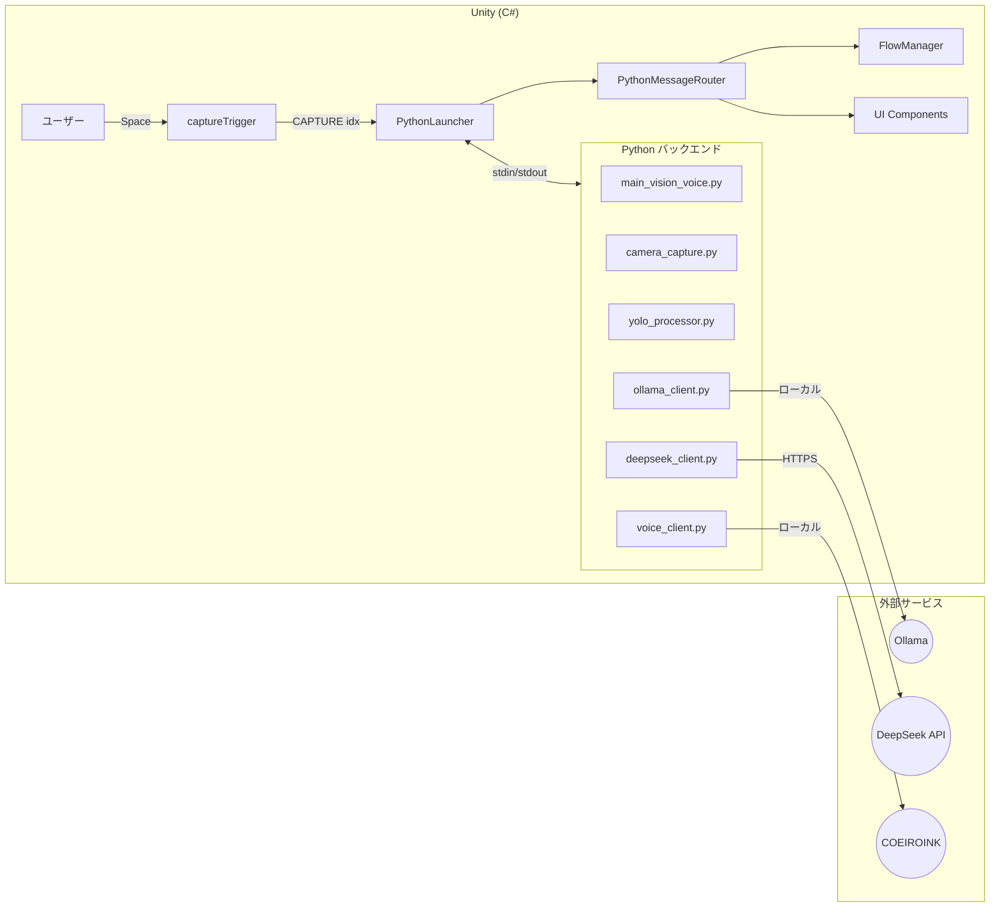
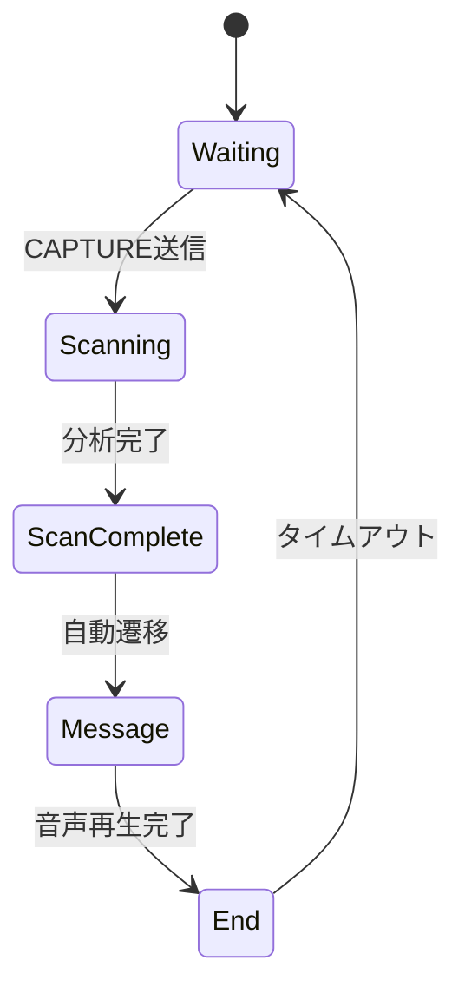

# モノ・ローグ (Mono-Logue)

体験者の「私物」が語りかけるインタラクティブ・インスタレーション

---

## システム概要

本システムは、**Unity (フロントエンド)** と **Python (バックエンド)** の2プロセス連携によるリアルタイムAI対話生成システムです。

```
[体験者] → [Webカメラ撮影] → [画像認識AI] → [セリフ生成AI] → [音声合成] → [画面表示]
```

| レイヤー | 技術 | 役割 |
|:---|:---|:---|
| **フロントエンド** | Unity (C#) | UI表示、入力制御、演出、音声再生 |
| **バックエンド** | Python | 画像認識、セリフ生成、音声合成 |
| **ローカルAI** | Ollama (qwen2.5vl:7b) | 画像分析（物体認識・状態判定） |
| **クラウドAI** | DeepSeek API | セリフテキスト生成 |
| **音声合成** | COEIROINK | ローカルTTS |

> 📖 詳細なシステム構成は [ProjectOverview.md](./Report/ProjectOverview.md) を参照

---

## アーキテクチャ



> 📖 詳細なワークフロー図は [WorkflowDiagram.md](./Report/WorkflowDiagram.md) を参照

---

## 処理フロー

### 状態遷移



### 画像処理パイプライン

| ステップ | 処理内容 |
|:---|:---|
| 1. 撮影 | 5フレームウォームアップ → 5フレーム中央値合成（フリッカー対策） |
| 2. 検出 | YOLO11による物体検出・クロップ |
| 3. 前処理 | CLAHE（コントラスト調整）→ rembg（背景除去） |
| 4. 分析 | Ollama による画像分析（形状・状態・名前判定） |
| 5. 生成 | DeepSeek API によるセリフ生成 |
| 6. 合成 | COEIROINK による音声合成 |

> 📖 Python処理の詳細は [PythonScriptLogic.md](./Report/PythonScriptLogic.md) を参照  
> 📖 Unity処理の詳細は [CSharpScriptLogic.md](./Report/CSharpScriptLogic.md) を参照

---

## ディレクトリ構成

```
Sostusei2512/
├── Assets/
│   ├── Scripts/              # Unity C# スクリプト
│   │   ├── FlowManager.cs         # 状態管理
│   │   ├── PythonLauncher.cs      # Python連携
│   │   ├── PythonMessageRouter.cs # メッセージルーティング
│   │   ├── captureTrigger.cs      # 撮影トリガー
│   │   ├── MessageWindowManager.cs # メッセージ表示
│   │   └── ...
│   ├── StreamingAssets/      # Python スクリプト & リソース
│   │   ├── main_vision_voice.py   # メインオーケストレーター
│   │   ├── camera_capture.py      # カメラ制御
│   │   ├── yolo_processor.py      # YOLO物体検出
│   │   ├── ollama_client.py       # Ollama画像分析
│   │   ├── deepseek_client.py     # DeepSeekセリフ生成
│   │   ├── voice_client.py        # COEIROINK音声合成
│   │   ├── prompts.py             # プロンプト定義
│   │   ├── config.json            # 設定ファイル
│   │   ├── capture/               # 撮影画像保存
│   │   ├── voice/                 # 生成音声保存
│   │   └── Message.txt            # メッセージログ
│   ├── Scenes/               # Unityシーン
│   ├── Fonts/                # フォントリソース
│   └── Medias/               # メディアリソース
├── Report/                   # 技術ドキュメント
│   ├── ProjectOverview.md
│   ├── WorkflowDiagram.md
│   ├── PythonScriptLogic.md
│   ├── CSharpScriptLogic.md
│   └── ...
└── README.md
```

---

## セットアップ

### 1. 前提条件

- **Unity** 2022.3 LTS 以降
- **Python** 3.10 以降
- **Ollama** インストール済み（qwen2.5vl:7b モデル）
- **COEIROINK** インストール済み（ポート50032）

### 2. Python依存関係

```bash
cd Assets/StreamingAssets
pip install ultralytics opencv-python rembg onnxruntime ollama watchdog openai python-dotenv
```

| ライブラリ | 用途 |
|:---|:---|
| `ultralytics` | YOLOv11 物体検出 |
| `opencv-python` | 画像処理 |
| `rembg` | 背景除去 |
| `ollama` | ローカルLLMクライアント |
| `openai` | DeepSeek API (OpenAI互換) |

### 3. 環境変数

`Assets/StreamingAssets/.env` を作成：

```
DEEPSEEK_API_KEY=sk-xxxxx
```

### 4. 起動手順

1. **Ollama** を起動
2. **COEIROINK** を起動（ポート50032）
3. **Unity** でプロジェクトを開き、再生

---

## 機材リスト

| 機材 | 用途 |
|:---|:---|
| Mac mini M2 | メイン処理 |
| BenQ MH550 プロジェクター | 投影 |
| Webカメラ | 物体撮影 |
| モバイルモニター | アーカイブ表示 |
| USB Hub / USB延長 | 接続 |
| HDMI 5m / 10m | 映像出力 |
| 電源タップ / 延長ケーブル | 電源供給 |
| ランカースタンド | 設置 |

---

## 関連ドキュメント

| ドキュメント | 内容 |
|:---|:---|
| [ProjectOverview.md](./Report/ProjectOverview.md) | プロジェクト概要・体験フロー |
| [WorkflowDiagram.md](./Report/WorkflowDiagram.md) | システムワークフロー図 |
| [PythonScriptLogic.md](./Report/PythonScriptLogic.md) | Pythonスクリプト詳細 |
| [CSharpScriptLogic.md](./Report/CSharpScriptLogic.md) | Unity C#スクリプト詳細 |
| [prompt_design.md](./Report/prompt_design.md) | プロンプト設計 |

---

## ライセンス

このプロジェクトは卒業制作として作成されました。