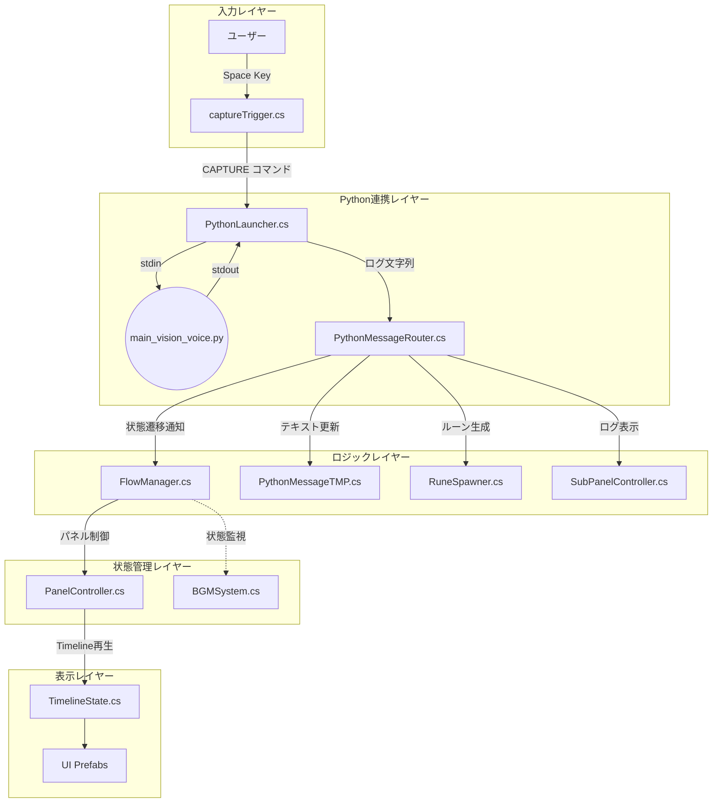
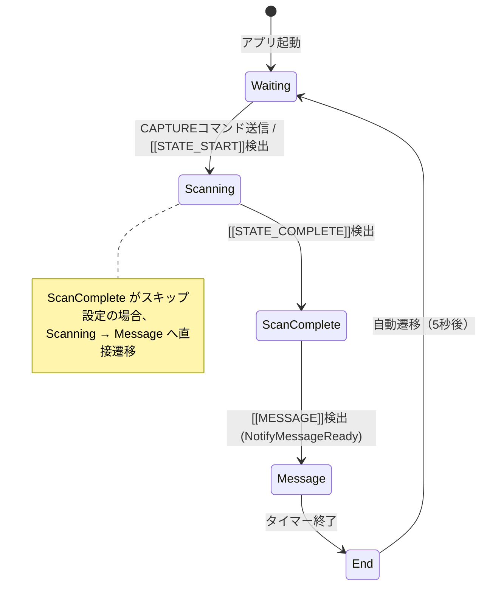
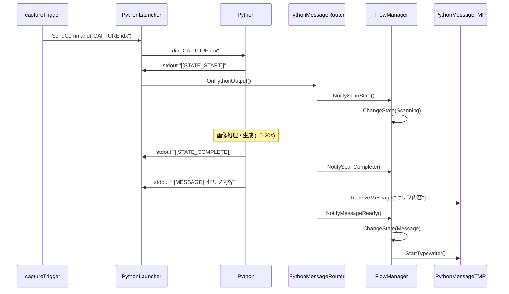

# Unity C# スクリプト構造・ロジックレポート

Last Updated: 2026-02-10
対象ディレクトリ: `Assets/Scripts/`

本ドキュメントでは、Unity C# スクリプトの構造、役割、および主要なロジックフローを詳細に解説します。

---

## 1. システムアーキテクチャ概要



---

## 2. 状態遷移（FlowState）

`FlowManager.cs` が管理する5つの状態と遷移トリガー：



---

## 3. スクリプト分類と詳細ロジック

### 🔵 Core Managers（全体制御）

#### [FlowManager.cs](../Assets/Scripts/FlowManager.cs)
**役割:** ステートマシンの中核。体験フロー全体を管理。

| メソッド | 呼び出し元 | 動作 |
|:---|:---|:---|
| `NotifyScanStart()` | PythonMessageRouter | Waiting → Scanning へ遷移 |
| `NotifyScanComplete()` | PythonMessageRouter | Scanning → ScanComplete へ遷移（スキップ判定あり） |
| `NotifyMessageReady()` | PythonMessageRouter | ScanComplete/Scanning → Message へ遷移 |
| `SetMessageDuration(float)` | MessageVoicePlayer | **(現在未使用)** Message状態の表示時間を設定 |
| `ChangeState(FlowState)` | 内部 | 状態遷移の実行・パネル制御通知 |

**状態遷移ロジック:**
現在は `Message` 状態の表示時間は固定（`STATE_DURATION`）または設定値に従い、音声ファイルの長さには依存しません（TTS無効化のため）。

---

#### [PanelController.cs](../Assets/Scripts/PanelController.cs)
**役割:** メインCanvasのUI切り替え。TimelineState Prefabを動的に生成・制御。

| プロパティ | 型 | 用途 |
|:---|:---|:---|
| `MessageDisplay` | PythonMessageTMP | Message Prefab内のテキスト表示コンポーネント |
| `RuneSpawnerDisplay` | RuneSpawner | ScanComplete Prefab内のルーン生成コンポーネント |
| `ScanningProgressDisplay` | ScanningProgressController | Scanning Prefab内の進捗制御コンポーネント |

---

### 🟢 Python Integration（外部連携）

#### [PythonLauncher.cs](../Assets/Scripts/PythonLauncher.cs)
**役割:** Pythonプロセスの起動・管理・通信

**プロセス間通信:**
```
Unity (C#) ──stdin──> Python (main_vision_voice.py)
Unity (C#) <──stdout── Python
```

- `Start()`: `/opt/homebrew/bin/python3.11` (または環境依存パス) でPython起動
- `SendCommand(string)`: stdinへコマンド送信（例: `CAPTURE <index>`）
- `Update()`: resultQueueからログを取り出し、Routerへ転送

---

#### [PythonMessageRouter.cs](../Assets/Scripts/PythonMessageRouter.cs)
**役割:** Pythonログの解析・振り分け。「司令塔」として各コンポーネントに通知。

**タグ検出ロジック:**
```csharp
public void OnPythonOutput(string line)
{
    if (line.Contains("[[STATE_START]]"))
        HandleScanStart();
    else if (line.Contains("[[CHARACTER]]"))
        HandleCharacter(line);  // キャラ名/異名 抽出
    else if (line.Contains("[[MESSAGE]]"))
        HandleMessage(line);    // セリフ抽出→表示
    else if (line.Contains("[[STATE_COMPLETE]]"))
        HandleScanComplete();
    // ...
}
```

---

#### [captureTrigger.cs](../Assets/Scripts/captureTrigger.cs)
**役割:** キー入力（スペース）を検知し、Pythonにキャプチャコマンドを送信

**入力制御ロジック:**
1. **Spaceキー**押下を検知
2. FlowStateがWaitingでなければ無視
3. クールダウン中（3秒）なら無視
4. カメラデバイスを検索（OBS等の仮想カメラを除外）
5. `CAPTURE <カメラインデックス>` を送信

---

### 🟡 Visual Effects & UI（演出・表示）

#### [PythonMessageTMP.cs](../Assets/Scripts/PythonMessageTMP.cs)
**役割:** 生成されたメッセージ本文とクレジット（異名）を表示

| メソッド | 動作 |
|:---|:---|
| `ReceiveMessage(string)` | メッセージを保持しMessage.txtに追記 |
| `SetCredit(string)` | クレジット情報（Twisted Nameなど）を保持し表示 |
| `StartTypewriter()` | TypewriterEffectTMPを開始 |

---

#### [RuneSpawner.cs](../Assets/Scripts/RuneSpawner.cs)
**役割:** メッセージを1文字ずつ空間に浮遊させるルーン文字演出

**生成ロジック:**
1. `SetMessage(string)` でメッセージ受信
2. `AutoSpawnLoop()` コルーチンでループ生成
3. 各文字を `RuneBehavior` 付きPrefabとして生成し、エンチャントテーブルへ吸い込ませる

---

#### [MessageHistoryDisplay.cs](../Assets/Scripts/MessageHistoryDisplay.cs)
**役割:** Waiting状態で過去のMessage.txtからランダムにメッセージを流す（Matrix風）

---

### 🔴 Audio & State-Based（音声・状態連動）

#### [BGMSystem.cs](../Assets/Scripts/BGMSystem.cs)
**役割:** Waiting状態専用のBGM再生システム（フェードイン/アウト制御）

#### [MessageVoicePlayer.cs](../Assets/Scripts/MessageVoicePlayer.cs)
**役割:** Pythonが生成した音声ファイルを再生
**(※注: 現在Python側でTTSが無効化されているため、このコンポーネントは待機状態のままタイムアウトまで再生を行いません)**

---

## 4. データフロー詳細

### A. 待機状態 (Waiting)
- FlowManagerがWaitingパネルを表示
- BGMSystemがフェードイン
- MessageHistoryDisplayが過去ログを流す

### B. スキャン～メッセージ (Scanning → Message)



---

## 5. 設計上の特徴

### 疎結合設計
- `FlowManager` は状態のみ管理、メッセージ解析は `PythonMessageRouter` に委任
- Python出力フォーマット変更時も `FlowManager` 修正不要

### 動的コンポーネント接続
- `PanelController` が Prefab 生成時にコンポーネント参照を自動取得
- `PythonMessageRouter` が動的に接続

### Prefabによる画面管理
- 各状態のUIはPrefabとして管理され、編集が容易
