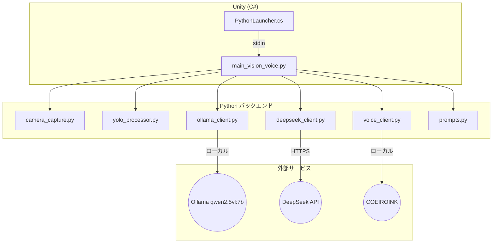
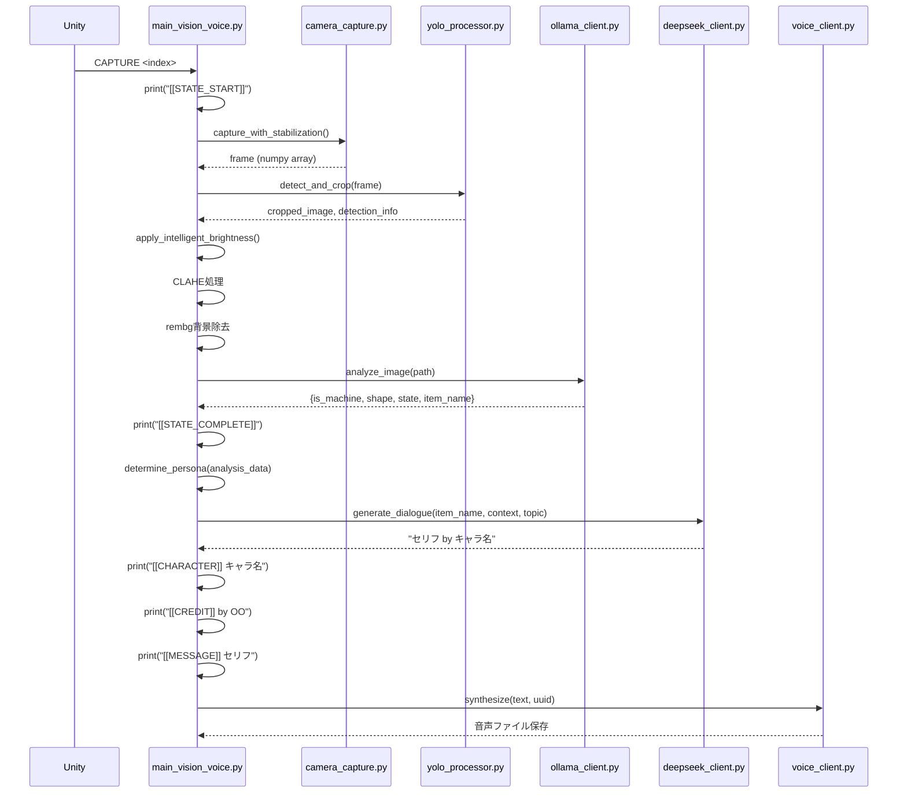
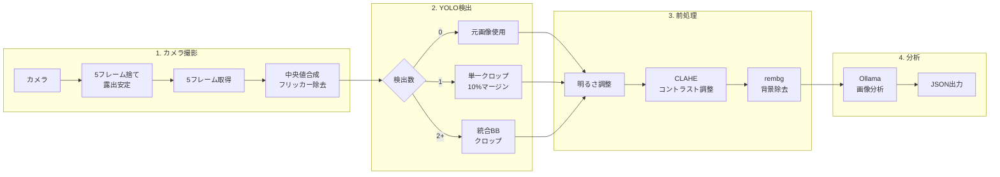

# Python スクリプト構造・ロジックレポート

**作成日:** 2026-01-08  
**対象ディレクトリ:** `Assets/StreamingAssets/`

本ドキュメントでは、Python スクリプトの構造、役割、および主要なロジックフローを詳細に解説します。

---

## 1. システムアーキテクチャ概要



---

## 2. 処理パイプライン



---

## 3. スクリプト詳細

### 🔵 メインオーケストレーター

#### [main_vision_voice.py](file:///Users/asanolab/Sotsusei1107/Assets/StreamingAssets/main_vision_voice.py)
**役割:** 全体の処理フローを統括。stdin監視、各モジュール呼び出し、stdout出力

**主要関数:**

| 関数名 | 役割 |
|:---|:---|
| `stdin_listener()` | Unityからのstdinコマンドを監視するスレッド |
| `process_frame(frame)` | カメラフレームを処理（YOLO→前処理→分析） |
| `_process_analysis(analysis_data, filename)` | 分析結果からセリフ生成・音声合成 |
| `determine_persona(analysis_data)` | 5段階優先度ロジックでペルソナ決定 |
| `get_voice_uuid(persona_id)` | ペルソナIDから音声UUIDをマッピング |
| `_save_message_pair(image, message, credit)` | MessagePairs.jsonに保存 |

**stdinコマンド処理:**
```python
def stdin_listener():
    while True:
        line = sys.stdin.readline().strip()
        if line.startswith("CAPTURE"):
            parts = line.split()
            camera_index = int(parts[1]) if len(parts) > 1 else 0
            
            print("[[STATE_START]]")
            frame = camera_capture.capture_with_stabilization()
            # ... 処理続行
        elif line == "QUIT":
            break
```

**ペルソナ決定ロジック（5段階優先度）:**
```python
def determine_persona(analysis_data):
    # 1. アイテム固有のペルソナ (item_obsessions.py)
    # 2. 機械/電子機器 → "Observer"
    # 3. 形状ベース (Round/Sharp/Square)
    # 4. 状態ベース (Old/Dirty/Broken)
    # 5. デフォルト → "Neutral"
    return (persona_id, role_name_jp)
```

---

### 🟢 カメラ制御

#### [camera_capture.py](file:///Users/asanolab/Sotsusei1107/Assets/StreamingAssets/camera_capture.py)
**役割:** フリッカー対策付きカメラ撮影モジュール

**CameraCaptureクラス:**

| メソッド | 動作 |
|:---|:---|
| `__init__()` | マニュアルモードでカメラ初期化（露出・コントラスト設定） |
| `initialize()` | カメラデバイスを開き、設定を適用 |
| `capture_with_stabilization()` | 5フレームウォームアップ + 5フレーム中央値合成 |
| `capture_single()` | 単純な1フレームキャプチャ（フリッカー対策なし） |

**フリッカー対策ロジック:**
```python
def capture_with_stabilization(self, warmup_frames=5, capture_frames=5):
    # 1. 露出安定のため warmup_frames フレーム捨てる
    for _ in range(warmup_frames):
        self.cap.read()
        time.sleep(0.05)
    
    # 2. capture_frames フレーム取得
    frames = []
    for _ in range(capture_frames):
        ret, frame = self.cap.read()
        if ret:
            frames.append(frame)
    
    # 3. 中央値を計算してフリッカー除去
    return np.median(frames, axis=0).astype(np.uint8)
```

**仮想カメラ除外:**
```python
EXCLUDED_CAMERA_KEYWORDS = ["obs", "virtual", "screen capture"]
# モジュール読み込み時にOBS仮想カメラプロセスを強制終了
kill_virtual_camera_processes()
```

---

### 🟡 オブジェクト検出

#### [yolo_processor.py](file:///Users/asanolab/Sotsusei1107/Assets/StreamingAssets/yolo_processor.py)
**役割:** YOLOv11によるオブジェクト検出とクロップ処理

**YOLOProcessorクラス:**

| メソッド | 動作 |
|:---|:---|
| `__init__()` | モデル名、信頼度閾値、マージン比率を設定 |
| `initialize()` | YOLOモデルをロード（遅延初期化） |
| `detect_and_crop(image)` | 検出数に応じたクロップ処理 |
| `_crop_with_margin()` | 10%マージン付きでクロップ |

**検出数に応じた処理:**

| 検出数 | 処理 |
|:---|:---|
| 0 | 元画像をそのまま使用 |
| 1 | 単一オブジェクトをクロップ（10%マージン） |
| 2+ | 全オブジェクトを含む統合バウンディングボックスでクロップ |

```python
def detect_and_crop(self, image):
    results = self.model(image, conf=self.confidence_threshold)
    detections = [...]  # 検出結果を収集
    
    if len(detections) == 0:
        return image, {"crop_type": "none"}
    elif len(detections) == 1:
        return self._crop_with_margin(...), {"crop_type": "single"}
    else:
        # 全検出を含む統合バウンディングボックス
        min_x1 = min(d["x1"] for d in detections)
        # ...
        return self._crop_with_margin(...), {"crop_type": "multi"}
```

---

### 🔴 AI クライアント

#### [ollama_client.py](file:///Users/asanolab/Sotsusei1107/Assets/StreamingAssets/ollama_client.py)
**役割:** ローカルOllama（qwen2.5vl:7b）への画像分析リクエスト

**分析フロー:**
1. 画像をBase64エンコード
2. `prompts.ANALYSIS_PROMPT` と共にOllamaへ送信
3. レスポンスからJSON抽出
4. キー正規化（タイポ修正、デフォルト値設定）

**出力形式:**
```json
{
  "is_machine": true/false,
  "shape": "Round/Sharp/Square/Other",
  "state": "Old/New/Dirty/Broken/Normal",
  "item_name": "オブジェクト名"
}
```

**キー正規化ロジック:**
```python
def _normalize_keys(self, data):
    # タイポ修正
    if "is_is_machine" in data:
        data["is_machine"] = data.pop("is_is_machine")
    
    # デフォルト値設定
    data.setdefault("is_machine", False)
    data.setdefault("shape", "Other")
    data.setdefault("state", "Normal")
    data.setdefault("item_name", "Unknown Object")
    return data
```

---

#### [deepseek_client.py](file:///Users/asanolab/Sotsusei1107/Assets/StreamingAssets/deepseek_client.py)
**役割:** DeepSeek APIへのセリフ生成リクエスト

**リクエスト構造:**
```python
def generate_dialogue(self, item_name, context_str, topic, obsession_instruction=None):
    full_prompt = (
        f"Role: Personify the object '{item_name}'.\n"
        f"{context_str}\n"
        f"Topic: {topic}\n\n"
        f"{prompts.CORE_LOGIC}\n"
        f"{obsession_instruction if obsession_instruction else ''}\n"
        f"{prompts.PERSONA_LOGIC}\n"
        f"{prompts.GEMINI_TASK}\n"
    )
    
    response = self.client.chat.completions.create(
        model="deepseek-chat",
        messages=[
            {"role": "system", "content": "You are the voice of an object..."},
            {"role": "user", "content": full_prompt}
        ],
        temperature=1.0  # 高い創造性
    )
    return response.choices[0].message.content.strip()
```

**出力形式:**
```
セリフ内容（60文字以内） by 捻った名前
```

---

#### [voice_client.py](file:///Users/asanolab/Sotsusei1107/Assets/StreamingAssets/voice_client.py)
**役割:** COEIROINK（ローカルTTS）への音声合成リクエスト

**APIエンドポイント:** `http://localhost:50032/v1/synthesis`

---

### 🟣 プロンプト設定

#### [prompts.py](file:///Users/asanolab/Sotsusei1107/Assets/StreamingAssets/prompts.py)
**役割:** 分析プロンプト、トピックリスト、ペルソナロジックを定義

**主要定数:**

| 定数名 | 用途 |
|:---|:---|
| `ANALYSIS_PROMPT` | Ollama分析用CoTプロンプト |
| `TOPIC_LIST` | ランダム選択されるトピック（25種類） |
| `CORE_LOGIC` | 記憶と状態描写重視の指示 |
| `PERSONA_LOGIC` | ニュアンスレベルの口調差 |
| `GEMINI_TASK` | 60文字制限・捻った名前の出力形式 |

**ANALYSIS_PROMPT (Chain-of-Thought形式):**
```
**Step 1: OBSERVATION**
List the visual features you observe...

**Step 2: REASONING**
Based on your observations, explain...

**Step 3: FINAL ANSWER**
Output your conclusion in strict JSON format...
```

**TOPIC_LIST (一部抜粋):**
- "A recent time you were used"
- "Being used after a long time of not being touched"
- "The quiet time when you weren't being used"
- "The feeling of the owner's hands"
- "Getting a scratch or stain"

---

#### [item_obsessions.py](file:///Users/asanolab/Sotsusei1107/Assets/StreamingAssets/item_obsessions.py)
**役割:** アイテム別「執着」指示の定義

特定のアイテム名に対して、より具体的な性格付けや話し方の指示を提供。

---

## 4. 画像処理パイプライン



**明るさ調整ロジック（apply_intelligent_brightness）:**
```python
def apply_intelligent_brightness(image):
    # 1. ガンマ補正 (gamma=1.5)
    gamma = 1.5
    inv_gamma = 1.0 / gamma
    table = np.array([((i / 255.0) ** inv_gamma) * 255 
                      for i in range(256)]).astype("uint8")
    result = cv2.LUT(image, table)
    
    # 2. 平均輝度が低い場合は底上げ
    mean_brightness = np.mean(cv2.cvtColor(result, cv2.COLOR_BGR2GRAY))
    if mean_brightness < 100:
        result = cv2.add(result, np.array([30.0]))
    
    return result
```

---

## 5. ファイル構造

```
StreamingAssets/
├── main_vision_voice.py      # メインオーケストレーター
├── camera_capture.py         # カメラ制御モジュール
├── yolo_processor.py         # YOLO検出・クロップ
├── ollama_client.py          # Ollama画像分析クライアント
├── deepseek_client.py        # DeepSeekセリフ生成クライアント
├── voice_client.py           # COEIROINK音声合成クライアント
├── prompts.py                # プロンプト定義
├── item_obsessions.py        # アイテム別執着指示
├── config.json               # 設定ファイル
├── .env                      # 環境変数（API Key）
├── yolo11n.pt                # YOLOモデル
├── capture/                  # 処理済み画像保存
│   └── raw/                  # 処理前の元画像
├── voice/                    # 生成された音声ファイル
├── Message.txt               # 生成されたメッセージのログ
└── MessagePairs.json         # 画像とメッセージのペア情報
```

---

## 6. 設定ファイル

### config.json
```json
{
  "VOICE_VARIANTS": {
    "Neutral": {"uuid": "...", "style": "default"},
    "Observer": {"uuid": "...", "style": "calm"},
    // ...
  },
  "PERSONALITY_PROMPTS": {
    // ペルソナ別のプロンプト追加指示
  },
  "PSYCHOLOGICAL_TRIGGERS": [
    // 心理的トリガーリスト
  ]
}
```

### .env
```
DEEPSEEK_API_KEY=sk-xxxxx
```

---

## 7. 依存ライブラリ

```bash
pip install ultralytics opencv-python rembg onnxruntime ollama watchdog openai python-dotenv
```

| ライブラリ | 用途 |
|:---|:---|
| `ultralytics` | YOLOv11 |
| `opencv-python` | 画像処理 |
| `rembg` | 背景除去 |
| `onnxruntime` | rembgの推論エンジン |
| `ollama` | ローカルLLMクライアント |
| `watchdog` | ファイル監視 |
| `openai` | DeepSeek API（OpenAI互換） |
| `python-dotenv` | 環境変数読み込み |

---

## 8. 関連ドキュメント

- [CSharpScriptLogic.md](./CSharpScriptLogic.md) - Unity C# スクリプト構造
- [WorkflowDiagram.md](./WorkflowDiagram.md) - 全体ワークフロー図
